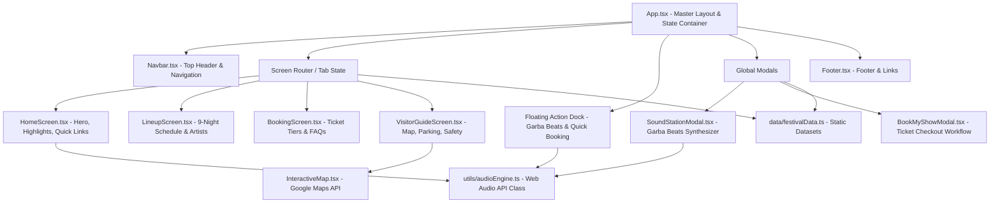

# 🌸 Rasutsav Navratri Mahotsav 2025

> **Experience India's Grandest Navratri Celebration** — 9 Sacred Nights of Rhythm, Garba, Raas, Aarti, Live Artist Lineup, BookMyShow Ticketing Integration, Web Audio Garba Sound Station, and Google Maps Live Arena Guide.

[](https://react.dev/)
[](https://www.typescriptlang.org/)
[](https://vitejs.dev/)
[](https://tailwindcss.com/)
[](https://developer.mozilla.org/en-US/docs/Web/API/Web_Audio_API)

---

## 📑 Table of Contents

- [Overview](#-overview)
- [Key Features](#-key-features)
- [Project Architecture](#-project-architecture)
- [Technology Stack](#-technology-stack)
- [Directory Structure](#-directory-structure)
- [Interactive Audio Synthesizer](#-interactive-audio-synthesizer)
- [Getting Started](#-getting-started)
- [Environment Variables](#-environment-variables)
- [Scripts](#-scripts)
- [Higher-Level Structure Mindmap (.mp)](#-higher-level-structure-mindmap-mp)

---

## 🌟 Overview

**Rasutsav Navratri Mahotsav 2025** is a modern, high-performance web application built with **React 19**, **TypeScript**, **Vite**, and **Tailwind CSS v4**. It serves as the digital portal for a 9-night Navratri festival featuring headline artists (Falguni Pathak, Aditya Gadhvi, Kinjal Dave, Osman Mir, Kirtidan Gadhvi, etc.), live arena maps, box office ticket booking integration, and an in-browser Web Audio API Garba sound studio.

---

## ⚡ Key Features

1. **🗓️ 9-Night Detailed Festival Lineup**:
   - Comprehensive schedule for each night (Oct 03 - Oct 11, 2025).
   - Tithi, auspicious color/dress code, artist bio, venue designation (AC Super-Dome vs. Open Heritage Lawn).
   - Direct audio preview integration for each night's rhythm style.

2. **🎟️ BookMyShow Ticketing Engine**:
   - Tiered pass booking (Single General, AC Dome Premium, 9-Night Season Pass, Couple Pass, Royal VIP Lounge, Free Community Aarti Pass).
   - Interactive `BookMyShowModal` with date selection, quantity counter, instant price calculator, and official checkout links.

3. **🎵 Web Audio API Navratri Sound Station**:
   - Pure Web Audio API synthesized sound generator (no external MP3/audio files needed).
   - Features authentic **Dhol 3-Taali**, **Aarti Temple Bells**, **Sanedo**, **Shankh Naad (Conch Shell)**, and **Dandiya Wood Clacks**.
   - Real-time Audio Visualizer canvas and adjustable BPM tempo control (70 - 180 BPM).

4. **🗺️ Interactive Google Maps Arena Guide**:
   - Live location mapping via `@vis.gl/react-google-maps`.
   - Dynamic view points for Festival Arena (GMDC Ground, Ahmedabad), Gates 1–6, 4 Box Office Hubs, and Live Parking Zones.

5. **🅿️ Real-time Parking & Gate Status**:
   - Live parking bay availability across Zone A (VIP), Zone B (4-Wheelers), Zone C (2-Wheelers), and Zone D (Cab Hub).
   - Safety helpline directory (Emergency 108, She Team 1091, Support).

---

## 🏗️ Project Architecture



---

## 💻 Technology Stack

| Category | Technologies / Libraries |
| :--- | :--- |
| **Framework & UI** | React 19, TypeScript, Tailwind CSS v4, Motion (Framer) |
| **Build Tooling** | Vite 8, Bun / Node.js, ESBuild |
| **Maps & Location** | `@vis.gl/react-google-maps` |
| **Audio Processing** | Web Audio API (`AudioContext`, `OscillatorNode`, `GainNode`, `BiquadFilterNode`, `AnalyserNode`) |
| **Icons & Visuals** | Lucide React (`lucide-react`), Canvas Confetti (`canvas-confetti`) |
| **Backend Integration**| Express (optional server runner), Google Gen AI (`@google/genai`) |

---

## 📁 Directory Structure

```
Rasutsav/
├── index.html                 # HTML Entry Point
├── metadata.json              # Web App Metadata & Capability Config
├── package.json               # Package Manifest & Scripts
├── tsconfig.json              # TypeScript Configuration
├── vite.config.ts             # Vite Configuration with Tailwind CSS
├── structure.mp               # High-Level Project Structure Mindmap File
├── README.md                  # Project Documentation
└── src/
    ├── main.tsx               # React DOM Rendering Entrypoint
    ├── App.tsx                # Master Component, State Management & Tab Navigation
    ├── index.css              # Global Tailwind Styles & Theme Overrides
    ├── components/
    │   ├── Navbar.tsx         # Header Navigation Bar
    │   ├── HomeScreen.tsx     # Landing Page Screen
    │   ├── LineupScreen.tsx   # 9-Night Artist & Event Lineup Screen
    │   ├── BookingScreen.tsx  # Pass Booking & Pricing Tier Screen
    │   ├── VisitorGuideScreen.tsx # Interactive Venue Map, Parking & Guide Screen
    │   ├── InteractiveMap.tsx # Google Maps Component with Venue Markers
    │   ├── SoundStationModal.tsx  # Interactive Web Audio Synthesizer Studio UI
    │   ├── BookMyShowModal.tsx    # BookMyShow Direct Checkout Modal
    │   ├── Footer.tsx         # Site Footer & Support Links
    │   └── Icons.tsx          # Custom Icons Utilities
    ├── data/
    │   └── festivalData.ts    # Datasets (9 Days, Passes, Parking, Box Office Hubs)
    └── utils/
        └── audioEngine.ts     # Web Audio API Synthesizer Class Singleton
```

---

## 🎵 Interactive Audio Synthesizer

The audio system is implemented in [`src/utils/audioEngine.ts`](file:///Users/bhaveshchavda/Documents/GitHub/Rasutsav/src/utils/audioEngine.ts) using pure Web Audio API synthesis without external audio samples.

### Synthesized Instruments:
- **Dhol Bass**: Sine wave oscillator with exponential frequency drop (135 Hz → 42 Hz) for deep Kathiyawadi/Baroda dhol thumps.
- **Dhol Treble**: High-frequency triangle wave (650 Hz → 220 Hz) simulating crisp chanti/tasha strikes.
- **Temple Brass Bell**: Multi-harmonic sine partials (1.0x, 2.01x, 3.02x, 4.2x base frequency) with long exponential decay.
- **Dandiya Clack**: Combined triangle wave drop + bandpass filtered white noise burst for authentic wood strike texture.
- **Shankh Naad**: Dual sawtooth & sine oscillator sweep (220 Hz → 330 Hz → 320 Hz) with lowpass filter ramp.

---

## 🚀 Getting Started

### Prerequisites
- Node.js (v18+) or Bun (v1.0+)

### Installation
```bash
# Clone the repository
git clone https://github.com/bhaveshchavda/Rasutsav.git
cd Rasutsav

# Install dependencies using Bun or npm
bun install
# or
npm install
```

### Running Development Server
```bash
bun run dev
# or
npm run dev
```
Open [http://localhost:3000](http://localhost:3000) in your browser.

### Building for Production
```bash
bun run build
# or
npm run build
```

---

## 🔑 Environment Variables

To activate Google Maps in the Visitor Guide screen, copy `.env.example` to `.env` and set your key:

```env
VITE_GOOGLE_MAPS_API_KEY=your_google_maps_api_key_here
```

---

## 📜 Higher-Level Structure Mindmap (.mp)

For a raw, structured textual mindmap and architectural blueprint of this project, inspect [`structure.mp`](file:///Users/bhaveshchavda/Documents/GitHub/Rasutsav/structure.mp) in the project root directory.

---

<p center="true">
  Made with ❤️ for <b>Rasutsav Navratri Mahotsav 2025</b>
</p>
